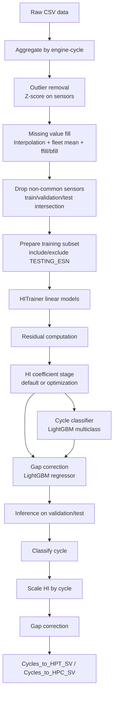
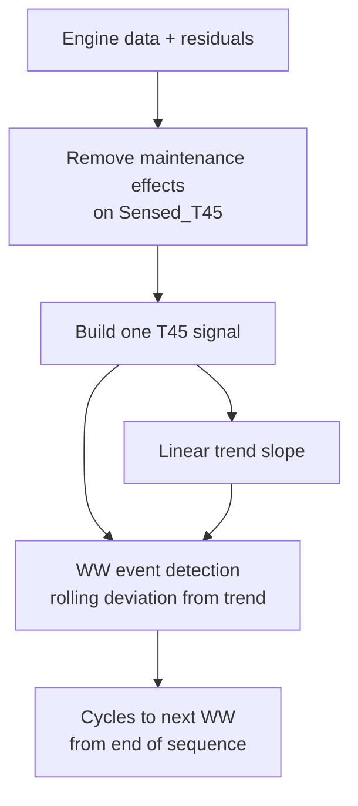
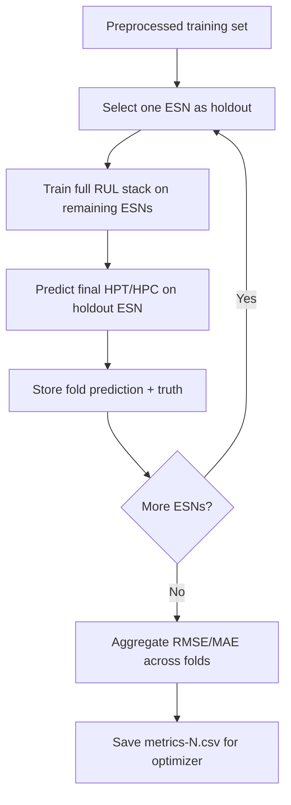

# Predictor Pipeline

## End-to-end RUL pipeline

## Water Wash pipeline

## Windowtraining LOEO

## Notes

- Aggregation is applied before outlier removal and missing-value filling.
- Sensor alignment updates active sensor lists to the shared intersection.
- RUL correction uses classifier output at inference and nearest known cycle fallback if a cycle is unseen.
- WW slope estimation and event detection now use the same T45 signal.
- WW prediction can reuse a global slope equal to the mean training slope (`WW_USE_TRAINING_MEAN_SLOPE=True`).
- Windowtraining mode uses LOEO cross-validation on the labeled training set.
- WW can be included in windowtraining objective with a proxy LOEO metric (`--windowtraining-include-ww` and optimizer `--include-ww-objective`).
